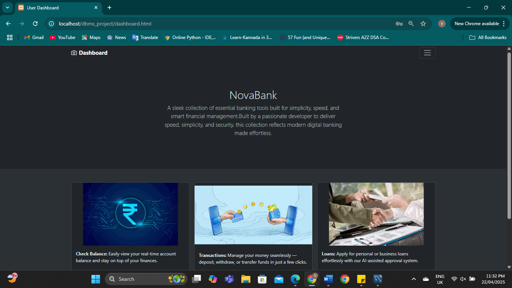

🏦 Banking Management System
A mini-project for managing banking operations like account creation, transactions and loan applications.
Built as a part of the DBMS curriculum using PHP, MySQL Workbench, HTML, and CSS.

📌 Features
- Account creation and customer details
- Deposit and withdrawal functionality
- View balance and transaction history
- Loan application and tracking
- Admin panel for overview and control

  🛠️ Tech Stack
Frontend :	   HTML, CSS
Backend	 :     PHP
Database :     MySQL (Workbench)

⚙️ How to Run
- Clone the repository :  git clone https://github.com/Vasudha-Nayak/Banking-Management-System.git
- Copy the folder into your XAMPP htdocs directory.
- Start Apache and MySQL from XAMPP.
- Import the database.sql file into phpMyAdmin.
- Visit http://localhost/dbms_project in your browser.

  📸 Screenshots
  
🖼️ Homepage

🖼️ User Dashboard

🖼️ Transations Page

🖼️ Admin Page

👩‍💻 Authors
Vasudha Nayak
Aditi H Nayak
2nd Year B.Tech – CSE
